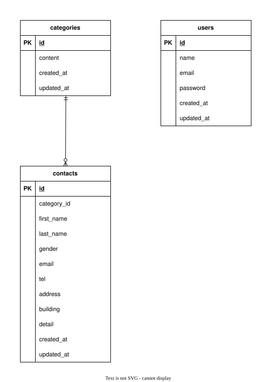

# アプリケーション名
お問い合わせフォーム
## 環境構築
### Dockerビルド
- git clone git@github.com:hatakeyamadan/contact-form-test.git
- cd contact-form-test
- docker-compose up -d --build
### Laravel環境構築
- docker-compose exec php bash
- composer install
- composer update laravel-lang/lang
- cp .env.example .env 環境変数を適宜変更
- php artisan key:generate
- php artisan migrate
- php artisan db:seed
## 使用技術
- php 8.1
- Laravel 8.83.8
- mysql 8.0.26
- nginx 1.21.1
## ER図

## 開発環境
- お問い合わせ画面 : http://localhost/
- ユーザー登録 : http://localhost/register
- phpMyAdmin : http://localhost:8080